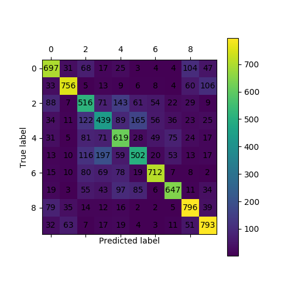

# AI-Security-Course

This Repo is mainly for the design and implementation of experiments in AI+Security course in ZJUSE.



Confusion matrix of CIFAR10 below.

## Getting Started

These instructions will get you a copy of the project up and running on your local machine for development and testing
purposes. See deployment for notes on how to deploy the project on a live system.

### Prerequisites

You maybe need Anaconda to create a virtual environment for running python.

```
conda create -n {name}=3.6
source activate {name}
```

### Installing

Then just install all python package required by our project by one cmd line:

```
pip install -r requirements.txt
```

End with an example of getting some data out of the system or using it for a little demo

## Running the tests and evaluation

Explain how to run the automated tests for this system

### Break down into end to end tests

Explain what these tests test and why

```
python test.py --path ./weights/.../20.pth -- device cuda
```

### And coding style tests

Explain what these tests test and why

```
python evaluate.py --gt ./result/gt.txt --pre ./result/prediction.txt
```

## Build your own model

### Change your model

Please read [CONTRIBUTING.md](https://gist.github.com/PurpleBooth/b24679402957c63ec426) for details on our code of
conduct, and the process for submitting pull requests to us.

### Train your model

## License

This project is licensed under the MIT License - see the [LICENSE.md](LICENSE.md) file for details

## Acknowledgments

* Hat tip to anyone whose code was used
* Inspiration
* etc
