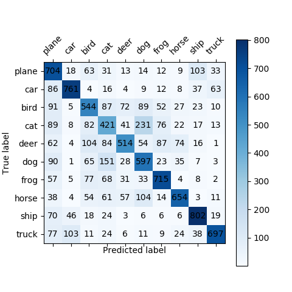

# AI-Security-Course

This Repo is mainly for the design and implementation of experiments in AI+Security course in ZJUSE.


Samples of CIFAR10

## Getting Started

These instructions will get you a copy of the project up and running on your local machine for development and testing
purposes.

### Prerequisites

You maybe need Anaconda to create a virtual environment for running python.

```shell
conda create -n name=3.6
source activate name
```

### Installing

Then just install all python package required by our project by one cmd line:

```shell
pip install -r requirements.txt
```

## Running the tests and evaluation

Explain how to run the automated tests for this system

### Generating predicted result

Given a well-trained classify model, we first take the test set of CIFAR10 as the input of the model and obtain
responsive predict labels via the following shell:

```shell
# feel free to change
python src/test.py --task_id 1 --epoch 20 --device cuda:3
```

After that you will get a .txt which contains all test result(10,000 digit):

```text
3 8 8 0 6 6 1 6 3 1 0 9 5 7 9 8 5 7 8 6 7 0 4 9 5 2 4 0 9 6 6 5 4 5 9 2 4 1 9 5 4 6 5 6 0 9 3 9 7 6 9 8 0 3 8 8 7
```

0~9 correspond to ('plane', 'car', 'bird', 'cat', 'deer', 'dog', 'frog', 'horse', 'ship', 'truck') respectively.

### Evaluate result

Run evaluate.py to evaluate test results:

```shell
python src/evaluate.py --task_id 1 --gt gt.txt
```

To find a better hyperparameter, we can run run_tests.sh to generate test result using different hyperparameter:

```shell
./run_tests.sh
```

After that you can use src/analysis.py to obtain some useful figures.

1. To show the test result intuitively, we draw a Confusion Matrix:

   

2. As the epoch of train increase, the loss on training set and Acc on test set as follows:

   

3. Changing learning rate in training process, the final test result(Acc) on test set as follows:

   

   Of course, they are trained during same epochs. From the figure we suggest that the learning rate should be less than
   0.008.

4. Finally, we change the method of model regularization: use both Batch Normalization and Dropout, only use Batch
   Normalization, only use Dropout, and use nothing.
   Here is the result:
   

   We can see that Dropout is more important for improving model performance than Batch Normalization in our project
   since there is almost no difference on Acc between whether to use Batch Normalization.

## Build your own model

### Change your model

Modify src/model.py

### Train your model

```shell
python src/train.py --task_id 1 --epoch 30 --lr 0.0003 --device cuda:0 >>src/tasks/task-1/output.log
```

## License

This project is licensed under the MIT License - see the [LICENSE](LICENSE) file for details

## Acknowledgments

* [PyTorch Tutorials](https://pytorch.org/tutorials/beginner/blitz/cifar10_tutorial.html)
* Jie Song VIPA
